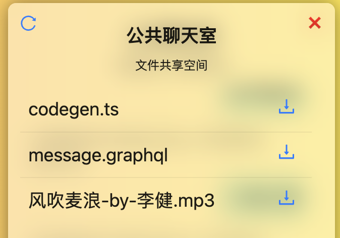

# Frontend (React & Webpack)

使用纯 HTML、CSS、JS 搭建网页，我们面临两个挑战：(1) 如果一次只改变部分（但很多）的页面元素，无论是用 JS 改 DOM 树还是重新写一个 HTML 都太费力 (2) 相同的页面元素组合只能复制粘贴，无法简单复用。为此，声明式、组件化的前端框架出现了。在本节中，我们会使用前端框架之一的 React 实现大部分的会议趣味功能，完成所有页面搭建。

### 环境配置

##### 1. 请确保已安装

- NodeJS 20（或更新），附带 npm 包管理器
- yarn 包管理器

```bash
node -v
npm -v
yarn -v
```

以上三条命令均返回版本号即说明安装成功

##### 2.（可选，建议）npm 和 yarn 换源

这里使用淘宝源和 yarn 官方源，网络情况基本稳定

```bash
npm config set registry https://registry.npmmirror.com
yarn config set registry https://registry.yarnpkg.com
```

##### 3. 依赖安装

注意：由于前端代码在子文件夹内，一定要先切换对应文件夹再执行 npm/yarn 指令

```bash
cd frontend
yarn # 是 yarn install 的简写
```

安装过程输出日志较长，请检查其中没有 error（warning 是正常的）

##### 4. 更改环境变量

前端的环境变量是以明文储存在`.env`文件中的，其中`REACT_APP_BACKEND_URL`是后端服务的地址，一般无需修改，如果已经在云服务器上部署了后端服务则可以改成对应地址；`REACT_APP_HASURA_HTTPLINK`和`REACT_APP_HASURA_WSLINK`是 hasura（数据库）服务的地址，如果你先前使用了 hasura.io 官网提供的 hasura 服务，则需要改成你自己的 GraphQL endpoint，如果是在服务器上部署的 hasura 则也改成对应地址（注意区分`http / https`和`ws / wss`）

此外，“关于这个工程”页的 JS 代码也使用到了后端服务，相应配置在`/frontend/public/config.js`中，对应变量`apiUrl`与`.env`文件中的`REACT_APP_BACKEND_URL`保持一致即可

### 运行方式

如果没有在云服务器上部署后端服务，请先在本地启动后端服务

```bash
cd backend
yarn start
```

在切换到前端文件夹后，运行

```bash
cd frontend
yarn start
```

会自动打开浏览器访问`http://localhost:3000`，等待打包完成即可看到网页

**NOTE 1**: 如果启动过程中出现关于`graphql.tsx`的报错，则可能是`../database`目录下的对于`.graphql`文件到修改没有同步过来。解决方法是，切换到`../database`目录，安装（`yarn`）并运行`yarn generate`，以更新`graphql.tsx`。

**NOTE 2**: 如果出现“获取房间列表错误失败“的提示，则可能是数据库中`room`与`user_room`表的权限设置问题导致graphql查询失败。解决方法是，将上述两个表的`user`用户的 select 权限全部开通。

**NOTE 2.5**: 如果出现“获取消息失败“的提示，则也有可能是数据库`user`表的权限设置问题导致graphql查询失败。解决方法是，将上表的`user`用户的 select 权限部分开通（勾选 Column select permissions 中的 username 与 uuid）。

**NOTE 3**: 目前的文件上传功能对于文件名称还有中文的文件的支持并不好。例如，上传`../frontend/public/assets` 目录下的文件 `李健-风吹麦浪.mp3` 时，接收到的文件（在 `../backend/upload/<会议室id>` 目录下）的文件名出现乱码，如下图所示。


但是，在磁盘中手动修改文件名为正常中文之后，刷新前端页面，也可以正常显示中文了，如下图所示。




### 已实现的功能

| 哈希值前 7 位 | 提交信息                         | 对应知识点                                                 | 实现效果                                           |
| ------------- | -------------------------------- | ---------------------------------------------------------- | -------------------------------------------------- |
| caa1dfb       | feat(05): Hello World from React | React 环境搭建、 React 项目文件结构                        | 主页内容被替换为 Hello World                       |
| f221e82       | feat(05): JSX elements           | JSX 基本语法、JSX 元素的堆叠                               | 主页上骰子工具的 UI                                |
| 652d84e       | feat(05): React Components       | React 组件、React Hook (useState、useEffect、useRef)       | 骰子功能实现、倒计时功能实现                       |
| ea94cd5       | feat(05): brick and mortar       | 组件的复合与嵌套、条件渲染、配合 JS 语法（map、filter 等） | 秒表功能集成到计时组件上                           |
| ca4c615       | feat(05): LoginPage              | 在 React 中使用包（antd、axios）                           | 登陆页面                                           |
| 58e0dd1       | feat(05): MainPanel              | 在 React 中使用包（react router、Apollo GraphQL）          | 登陆页面的跳转逻辑和主页上的控制台组件             |
| f8cb54b       | feat(05): ChatBox & FileShare    | 无                                                         | 聊天室和文件共享功能                               |
| ddfa9bd       | feat(05): UX improvements        | 无                                                         | 提升用户体验，包括组件可拖拽、按需加载和移动端适配 |

### 注意事项

##### 关于 rimraf

由于前端使用到的 npm 包通常数量较大、依赖复杂、占用空间大，因此如果操作失误需要推倒重来，在 windows 系统中使用正常的删除操作，node_modules 文件夹可能耗费很长的时间，甚至导致系统的崩溃。为此，有必要安装 rimraf 这个 npm 包，来实现类似于 Linux 系统中的`rm -rf`命令

```bash
npm install rimraf -g
rimraf node_modules # 删除某个文件夹，如 node_modules
```

### 作业

对于已完成数据库或后端作业的同学，可以选择其中之一完成相应的前端界面，如下：

- 【数据库】聊天室的消息可以选择回复之前的某条消息，但没有多层回复或多重回复
  - 提示：可以使用右键菜单实现回复功能（JSX 元素的`onContextMenu`属性），可以使用如 react-contextify 的 npm 包来简化代码（[fkhadra/react-contexify: 👌 Add a context menu to your react app with ease (github.com)](https://github.com/fkhadra/react-contexify)）
- 【数据库】会议进行时可以添加（多个）实时会议记录，记录没有创建者、但要有创建时间和修改时间
  - 提示：UI 方面可以直接使用`<input/>`或 antd 的`<Input/>`，建议实现自动保存功能
- 【数据库】便签纸功能，用户可以为每个会议创建一个便签纸，便签纸仅自己可见
  - 提示：UI 方面可以直接使用`<input/>`或 antd 的`<Input/>`，如果对实现 markdown 记事本感兴趣，也可以使用如 react-markdown 的 npm 包（[remarkjs/react-markdown: Markdown component for React (github.com)](https://github.com/remarkjs/react-markdown)）
- 【后端】”忘记密码？”：对于用户名为邮箱的用户，允许其通过密码重置邮件来修改密码
  - 提示：需要实现两个独立页面及其路由，分别是输入用户名（即邮箱）请求重置密码的页面（对应`/user/change-password/request`）、和邮件跳转链接到的输入密码而后重置的页面（对应`/user/change-password/action`）
- 【后端】“痕迹抹除”：允许删除用户和删除文件
  - 提示：需要注意删除后的 UI 表现（如删除用户后应当退出登录）

对于尚未完成以上前置作业的同学，也可以从以下几组功能需求中选择一组实现：

提示：你有可能需要修改 graphql 文件并重新生成 graphql.tsx 来完成一些数据库操作

- 更专业的会议功能
  - 修改会议简介：使用 antd 的`Typography.Text`中`editable`属性实现原地编辑并修改会议简介，需要参考[Typography - Ant Design](https://ant.design/components/typography#typography-demo-editable)
  - 邀请码二维码：将邀请码以二维码的形式呈现出来，二维码的内容可以是邀请码本身、也可以是加入该会议的网页链接（具体实现方式不限），组件用法可参考[QRCode - Ant Design](https://ant.design/components/qr-code#qr-code-demo-popover)
  - 退出会议：目前点击“退出会议”按钮，会提示“暂未实现”，那么请实现这个功能吧
- 更人性化的聊天室
  - 消息撤回：对于已发送时间未满 2 分钟的消息，允许用户通过右键菜单撤回（JSX 元素的`onContextMenu`属性），可以使用如 react-contextify 的 npm 包来简化代码（[fkhadra/react-contexify: 👌 Add a context menu to your react app with ease (github.com)](https://github.com/fkhadra/react-contexify)）
  - @我：在消息中输入@即可选择提及会议中的任何一个人（或@All），被提及的人看该条消息的显示效果与其他人不同（具体 UI 不限），推荐使用 antd 的 Mentions 组件，参考[Mentions - Ant Design](https://ant.design/components/mentions)
- 更智能的文件共享
  - 文件搜索：如果文件共享空间中的文件过多，很难一下子找到自己想要的文件，这时候就需要搜索功能了。你可以使用 JS 的`Array.filter()`方法
  - 文件预览：对于图片、pdf、word 文档等类型的文件，我们可以提供在线预览，方法参照[React 组件，用于预览文件（PDF、Excel、Word、图片） - 掘金 (juejin.cn)](https://juejin.cn/post/7270173202454085684)，要求至少实现 pdf 文件的预览（可以在原页面预览，也可以专门新建一个页面及其路由供预览）
- 更有趣的游戏互动
  - 对于将这个软件作为桌游辅助工具的用户，除了投骰子、计时这种“单机”的需求，还希望我们能基于“用户——会议——消息”的关系，提供一些简单的聚会游戏（如谁是卧底、真心话大冒险、狼人杀等），请选择一款你熟悉的聚会游戏，仿照已有功能自拟界面，实现完整的游戏体验。
  - 注意：唯一支持联机共享的信息就是聊天室的消息，你所选择的游戏内所有互动必须基于消息（如在本地对是否能发送消息做限制、或对消息内容做判断从而决定胜负）。除此之外，游戏内还可以使用“伪联机”的功能，即在某一个用户（上帝）的浏览器中完成的操作通过消息同步到其他客户端（如某个人操作随机抽签后将结果加密发消息到聊天室）。当然，这套机制成立的前提是所有客户端都按同样地规则友善地解读和发送消息，因此我们必须对聊天室/消息的类型做人为划分（如将“狼人杀”作为特殊词、并将以“【狼人杀】”开头的聊天室适用狼人杀规则，或者聊天室功能不变、将特定开头的消息过滤到一个额外的“聊天室”）
